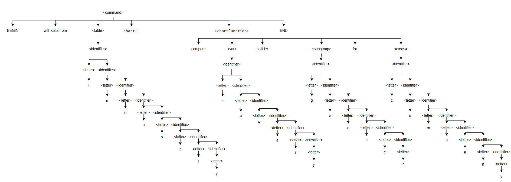

This repository defines a Domain-Specific Language (DSL)
designed to generate data visualizations such as bar charts(multiple types),
pie charts, line graphs, histograms, and other common chart types. Our DSL
allows users to execute charting commands using simple natural language constructs.

# Grammar Overview:
The syntax of our DSL is based on a collection of easy commands which
correspond to different types of data visualizations
and operations.

## Grammar Structure

```
<command> ::= "with" <data> "from" <table> "chart:" <chartFunction>

<chartFunction> ::= "compare" <var> "for" <cases>  
                 | "differences" <var> "for" <cases>  
                 | "contrast" <var> "for" <cases>  
                 | "versus" <var> "for" <cases>  
                 | "compare" <var> "split by" <subgroup> "for" <cases>  
                 | "compare" <var> "grouped by" <subgroup> "for" <cases>  
                 | "differences within" <subgroup> "for" <cases>  
                 | "show" <var> "stacked by" <subgroup> "for" <cases>  
                 | "show" <var> "subgroups" <subgroup> "for" <cases>  
                 | "show correlation between" <continuousVar> "and" <continuousVar>  
                 | "log" <trendKeyword> <continuousVar> "from" <range>  
                 | "show proportion of" <var> "by" <cases>  
                 | "show share of" <var> "by" <cases>  
                 | "show percentage of" <var> "by" <cases>  
                 | "show frequency of" <var> "by" <range>  
                 | "show distribution of" <var> "by" <range>  
                 | "show frequency in" <range> "buckets"  
                 | "accumulation of" <continuousVar> "for" <cases> "from" <range>  
                 | "stacked trend of" <continuousVar> "for" <cases>  
                 | "scatter plot of" <var> "and" <var>  
                 | "pattern of" <var> "and" <var>  
                 | "bubble of" <var> "," <var> "," <var> "for" <cases>

<table> ::= <identifier>

<data> ::= <var> | <continuousVar> | <var> "at" <var>

<var> ::= <identifier>

<continuousVar> ::= <identifier> | <identifier> "," <continuousVar>

<continuousCases> ::= <identifier> | <identifier> "," <continuousVar>

<range> ::= <identifier> "to" <identifier>

<loop> ::= "while" "(" <condition> ")" ":"

<conditionalStatement> ::= "if" "(" <condition> ")" ":"

<condition> ::= <logicalOperation>
              | "!" <condition>
              | <condition> ("and" | "or") <condition>
              | "(" <condition> ")"

<logicalOperation> ::= <operationBody> <logicalOperationSign> <operationBody>

<operationBody> ::= <operation>
                  | "(" <operation> ")"
                  | <operationBody> <operationSign> <operationBody>

<operation> ::= <identifier> | <identifier> <operationSign> <identifier>

<operationSign> ::= "+" | "-" | "*" | "/"

<logicalOperationSign> ::= "<" | "<=" | ">" | ">=" | "==" | "!="

<subgroup> ::= <identifier>

<cases> ::= <identifier>

<identifier> ::= <letter> | <letter> <identifier> | <identifier> <digit>

<trendKeyword> ::= "progression of" | "trend of" | "growth of"

<letter> ::= "a"|"b"|...|"z"|"A"|"B"|...|"Z"

<digit> ::= "0" | "1" |...| "9"
```

## Tokens and Rules

* \<command\>: Defines a basic command for data visualization.
* \<chartFunction\>: Specifies the charting function to apply (e.g., comparison, accumulation, or frequency).
* \<var\>: Represents a variable in the data, such as "sales", "population", etc. It represents a column from the table.
* \<cases\>: Refers to the different categories or cases for comparison.
* \<subgroup\>: Used for grouping the data into smaller categories (e.g., age groups, product categories) when working with Stacked or Grouped Bar Chart.
* \<range\>: Specifies a range of values for use in histograms or line graphs. (e.g., "0-5000").
* \<continuousVar\>: A continuous variable that can span a range of values.


## Example Chart Definitions
# Bar Chart
Use case: Compares a single variable across multiple cases.
* Keywords: "compare", "differences", "contrast", "versus"

```
with data from employees chart:
    compare salary for employees
```

# Bar Chart (Grouped/Split)
Use case: Compares a variable split into subsets, across various cases (for
example salary for both men and women in x companies). It contrasts subsets within and across individual cases, not useful
for comparing total values for cases.
* Keywords: "compare" in combination with "split by", "grouped by"; "differences within X"

```
with data from industry chart:
    compare salary split by gender for company
```

# Bar Chart (Stacked)
Use case: Compares the value of one variable split into 2 or more subsets, across various cases.
Best for comparing TOTALS across cases and subsets within cases.
* Keywords: "stacked by", "split by", "subgroup"

```
with data from complaints chart:
    show harassment complaints stacked by region for field

```

# Line Graph
Use case: Compares continuous variables for one or more cases.
Keywords: "log", "trend of", "progression of", "growth of", "show correlation between X and Y"
```
with data from sales chart:
    log progression of revenue from 2019 to 2024;
```
```
with data from experiment chart:
    show correlation between temperature, viscosity for oil, water
```


# Pie Chart
Use case: Shows the proportion of a single variable for multiple cases (when you compare one segment to a whole)
* Keywords: "proportion of", "share of", "percentage of"
```
with data from market chart:
    show proportion of market share by company
```


# Histogram
Use case: Compares two variables, with one segmented into ranges that function like the cases in a bar graph(service 
workers - continuous variable - whose salary is 0-5000, 5001-10000, etc.). Best for comparing segments within continuous data sets.
* Keywords: "frequency", "range", "buckets", "distribution"
```
with data from salary chart:
    show frequency of employees by salary range
```

# Area Chart
Use Case: Compares 2 continuous variables for one or more cases
* Keywords: "accumulation of", "stacked trend"
```
with data from market chart:
    accumulation of revenue for product from 2010 to 2024
```
```
with data from research chart:
    stacked trend of population growth in continents;
```


# Scatterplot
Use Case: Compares 2 variables at multiple data points for a single case. Best for showing distribution of data, when there is no clear trends, or when focus is on outlying data points.
* Keywords: "pattern of", "scatter plot of"
```
with data from research chart:
    scatter plot of hours studied and exam score
```

# Bubble Chart
Use Case: Compares 3 variables at multiple data points for a single case. It emphasizes
the relationship between the third variable(the bubbles) and the first two
* Keywords: "bubble of"
```
with data from economy chart:
    bubble of GDP, life expectancy, and population for countries;
```

# Example of loop and conditional statement
Where ```i``` could be the time segment.
```
i = 0
x = col...
while (i < 10) :
    with x at i from economy chart:
        scatter plot of col 
    i = i + 1
```

# If statement
```
x = 0
if(1+2<3):
    x = 10
else:
    x = 1    
```


# Derivation Tree
The code used for the derivation tree is for the Bar Chart (Grouped/Split), that compares a variable split into subsets, across various cases (for
example salary for both men and women in x companies). 

```
with data from industry chart:
    compare salary split by gender for company
```

